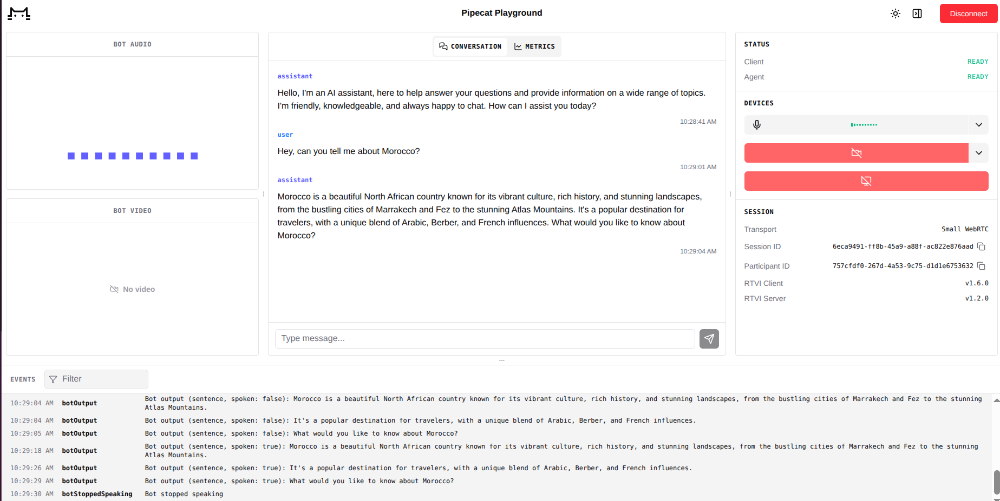

# simple-pipecat-bot

A minimal voice AI bot built with [Pipecat](https://github.com/pipecat-ai/pipecat). It runs a real-time speech-to-speech pipeline entirely through **Groq** (STT + LLM + TTS) over a **WebRTC** transport with **Silero VAD** for voice activity detection.

This is a quick-start reference — the smallest working Pipecat bot you can run locally.

---

## Pipeline

```
Microphone
    └─► WebRTC input
            └─► Groq STT (Whisper)
                    └─► User context aggregator (+ Silero VAD)
                                └─► Groq LLM
                                        └─► Groq TTS
                                                └─► WebRTC output
                                                        └─► Assistant context aggregator
```

| Stage | Component | Role |
|---|---|---|
| Transport | WebRTC | Bidirectional audio I/O with the client |
| VAD | Silero | Detects when the user stops speaking to trigger the pipeline |
| STT | Groq (Whisper) | Transcribes user speech to text |
| LLM | Groq | Generates a conversational response |
| TTS | Groq | Converts the response text back to speech |
| Context | `LLMContextAggregatorPair` | Keeps conversation history across turns |

---

## Tech Stack

- **[Pipecat](https://github.com/pipecat-ai/pipecat)** `>=0.0.103` — real-time voice AI framework
- **[Groq](https://groq.com)** — ultra-fast inference for Whisper STT, LLaMA LLM, and PlayAI TTS
- **[Silero VAD](https://github.com/snakers4/silero-vad)** — lightweight voice activity detection
- **Python 3.12** managed with **[uv](https://docs.astral.sh/uv/)**

---

## Prerequisites

- Python 3.12+
- [`uv`](https://docs.astral.sh/uv/getting-started/installation/) installed
- A [Groq API key](https://console.groq.com)

---

## Setup

```bash
# 1. Clone
git clone https://github.com/<your-username>/simple-pipecat-bot.git
cd simple-pipecat-bot

# 2. Install dependencies
uv sync

# 3. Configure environment
cp .env.example .env
# Edit .env and set GROQ_API_KEY
```

---

## Running

```bash
uv run python main.py
```

The terminal will print a client URL, for example:

```
Open this URL in your browser: http://localhost:7860
```

Open that URL — it's a built-in web client provided by Pipecat. Click the **Connect** button in the top-right corner, allow microphone access, and the bot will greet you.



Try saying something like:
> *"Give me some info about Morocco"*

The bot will:

1. Greet you and briefly introduce itself as soon as you connect.
2. Listen for your speech (Silero VAD handles turn detection).
3. Transcribe → reason → speak back in a loop.
4. Shut down cleanly when you disconnect.

---

## Project Structure

```
.
├── main.py           # Full bot definition and entry point
├── pyproject.toml    # Dependencies (uv/pip)
├── .python-version   # Pins Python 3.12
├── .env.example      # Required environment variables
├── screenshots/      # UI screenshots
└── .gitignore
```

---

## Customization

| What | Where in `main.py` |
|---|---|
| System prompt / personality | `messages` list in `run_bot()` |
| Greeting message | `on_client_connected` handler |
| LLM model | `GroqLLMService(model=...)` |
| TTS voice | `GroqTTSService(voice=...)` |
| Enable/disable metrics | `PipelineParams(enable_metrics=...)` |

---

## License

MIT
